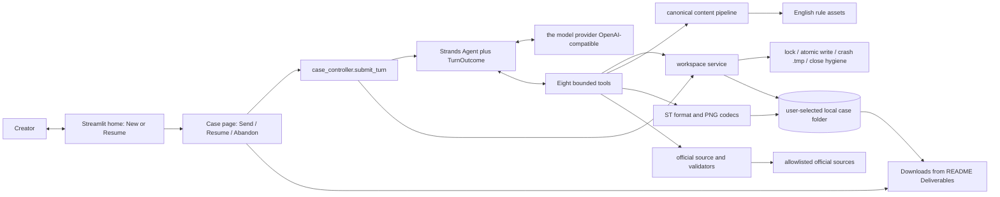

---

> **Amendment — 2026-09-06 (user decision, product owner)**
> Development model provider amendment: the provider is any OpenAI-compatible endpoint (for example `https://api.example.com/v1`), connected via the Strands OpenAI-compatible provider adapter. The UI sidebar accepts provider, base URL, model ID, and API key per process; CLI and spike paths read the environment. The former `bedrock-credentials-missing` blocker is void; model selection is an authorized implementation decision. Where this document names "Bedrock"/"AWS" for the development model provider, the OpenAI-compatible provider above is the effective configuration. Architecture boundaries, scope, and product behavior otherwise unchanged.

# Technical Architecture

## 1. Architecture Judgment

ST-Agent will be a local, single-process Python application with one Strands agent and a thin Streamlit interface. Windows is the primary implementation and acceptance environment. Strands owns the model-driven reasoning loop and tool selection. Deterministic application services own case state, file access, format construction, validation, recovery, and delivery gates.

This boundary gives the demo visible agent autonomy without allowing a model response to become the authority for whether a file exists, is valid, or is ready to deliver.

The user confirmed this boundary under C-026. It is now a frozen direction for the development plan.

P0 does not require a database, background worker, custom API server, multi-agent graph, MCP server, container platform, or AgentCore deployment.

## 2. System Context



All components run in the Streamlit process for P0. the model provider (development model provider via OpenAI-compatible API) and the allowlisted official format sources are the only required network integrations. The eight tools are `save_brief`, `save_content_document`, `build_character_card`, `build_lorebook`, `build_png_card`, `check_official_sources`, `validate_deliverables`, and `finish_case`.

## 3. Proposed Technology Baseline

| Area | Baseline | Reason |
| --- | --- | --- |
| Language | Python 3.12 | Supported by the Python SDK and well suited to Streamlit, image processing, schemas, and local files |
| Primary platform | Windows development environment | Cursor performs all implementation and acceptance work there; paths and instructions must work in that environment |
| Agent framework | `strands-agents` Python SDK | Provides the agent loop, model-provider integration (OpenAI-compatible / other adapters), custom tools, structured output, hooks, and metrics |
| Model provider | an OpenAI-compatible provider (OpenAI-compatible, `https://api.example.com/v1`) via the Strands OpenAI-compatible provider adapter | Changed from Amazon Bedrock by user decision 2026-09-06; keeps a single provider integration |
| Initial model | the model provider `hy3` default; authorized list `hy3` / `mimo-v2.5` / `glm-5.3-flash` / `qwen3.8-flash`, configurable by environment | User-authorized 2026-09-06; final lock depends on access, quality, latency, and cost checks |
| UI | Streamlit | One local page can handle chat, upload, progress, resume, and downloads |
| Data models | Pydantic | Validates case state, agent turn outcomes, canonical content, and format inputs |
| JSON validation | Pydantic plus targeted JSON Schema/custom validators | The ST implementation profile contains rules that generic schema validation alone cannot express |
| Images | Pillow plus a tested PNG card-chunk adapter | Pillow handles supported image decoding and PNG conversion; the adapter owns card metadata semantics |
| HTTP | `httpx` | Small, timeout-aware client for fixed official source URLs |
| Tests | pytest | Supports unit, integration, golden-file, and live smoke-test layers |
| Packaging | `pyproject.toml` with an exact tested dependency lock | Produces a repeatable local application and acceptance environment |

The project will use the core Strands SDK and project-owned custom tools. It will not depend on the community `strands-agents-tools` package for P0 because the required tool set is small and needs stricter file and network boundaries.

Application code uses `pathlib` and avoids POSIX-only shell, path, permission, and process assumptions. Portability remains desirable, but only the Windows environment must pass P0 acceptance; unsupported platforms are not promised without evidence.

## 4. Product Modules to Engineering Components

| Product module | Engineering components | Responsibility |
| --- | --- | --- |
| M-01 Interaction Entry | `st_agent.ui.app`, `st_agent.ui.view` | Collect local root, messages, and uploads; render questions, sanitized tool events, errors, and README Deliverables downloads |
| M-02 Creation Core | `st_agent.application.case_controller`, Strands `Agent`, English rule assets | Understand intent, choose the next action, create content, and decide when a user answer is required |
| M-03 File and Reference Tools | bounded tool facade, input readers, format codecs, PNG codec, official source client, validators | Turn agent requests into constrained and verifiable file or reference results |
| M-04 Case and Delivery | `application/case_controller.py`, workspace service, lifecycle policy | Persist input first, enforce transitions, recover work, gate delivery, and clean temporary case data |

Dependency direction is one way:

```text
UI -> Case Controller -> Agent Runtime -> Tool Facade -> Domain Services -> Adapters
                   \-> Workspace Service --------------------------/
```

The UI never calls format codecs directly. The agent never receives an unrestricted filesystem path, HTTP client, shell, or general-purpose code execution tool.

## 5. One-Turn Execution Contract

Each Streamlit interaction follows the same sequence:

1. The UI submits one user message, action, or upload batch to the case controller.
2. The controller validates the selected root and saves the complete input before any model call.
3. The workspace service loads the active case manifest, intake, brief, canonical text, artifact metadata, and applicable rules.
4. The controller creates a fresh Strands agent for this invocation and supplies a bounded case context plus project-owned tools.
5. The agent asks one necessary question or autonomously calls tools to advance the work.
6. Tool results update files first; the case manifest advances only after the new file is complete and verified.
7. The agent returns a Pydantic-validated `TurnOutcome` for the UI.
8. The controller independently checks the requested transition. A text claim such as “ready” cannot bypass missing artifacts or validation.
9. Strands hooks publish tool-start, tool-success, tool-failure, and invocation-complete events to Streamlit. Hidden reasoning and raw prompts are not displayed.

The current Python invocation API with `structured_output_model` will be used for `TurnOutcome`; the deprecated standalone structured-output method will not be used.

## 6. Case State and File-Based Recovery

### 6.1 State authority

The user-selected project folder remains the only recoverable task site. Strands session persistence will not be used as business state because it would create a second conversation history outside the product workspace and complicate case-close cleanup.

During an active case, `00-work/case.json` is the machine-readable state authority. `00-work/status.md` remains the human-facing recovery entry required by the PRD: it is generated from the manifest and points to the valid work files, blocker, and next step. Both are temporary and are removed after successful delivery or explicit abandonment.

`case.json` contains only the data needed to resume safely:

- case ID and state schema version;
- new or modify mode;
- current phase and active, waiting-for-user, blocked, or cleanup-pending condition;
- requested card and lorebook outputs;
- logical references and hashes for accepted inputs;
- current brief revision and derived artifact lineage;
- pending question or blocker;
- bounded retry counters and the last recoverable error;
- paths and validation status for deliverables.

Conversation content remains in `intake.md` and the current interpretation remains in `brief.md`. Drafts, canonical final text, assets, and exports stay in the PRD-defined directories.

The lifecycle uses two independent fields so a blocker does not erase which step must resume:

| Field | Values | Meaning |
| --- | --- | --- |
| `phase` | `setup`, `intake`, `qa`, `draft`, `final_text`, `build`, `official_check`, `validate`, `delivery`, `cleanup` | The earliest unfinished product step |
| `condition` | `active`, `waiting_for_user`, `blocked`, `cleanup_pending` | Why execution can or cannot continue now |

`closed` and `abandoned` are terminal outcomes recorded in the root `README.md`; they are not resumable active-case conditions. Their temporary manifest is removed after cleanup.

Allowed transitions are deliberately narrow:

- a new case moves from `setup` to `intake`, then to `qa` or directly to `draft` when existing material is sufficient;
- content normally advances through draft, final text, build, official check, validation, delivery, and cleanup;
- any content phase may return to `qa` only when a newly discovered gap changes user intent or required authorization;
- a tool or provider failure stays on the same phase and becomes `blocked` after its retry budget is exhausted;
- a valid user answer clears `waiting_for_user` or a user-resolvable blocker and resumes the same phase;
- changed input moves the case to the earliest affected phase and invalidates downstream lineage;
- successful cleanup removes active state; explicit abandonment enters cleanup without running delivery.

### 6.2 Safe writes and invalidation

- Every mutation is scoped to one resolved case root.
- Files are written to a sibling temporary file, flushed, and atomically replaced.
- A per-case lock prevents two Streamlit reruns from writing the same case concurrently.
- The content file is committed before `case.json` marks its step complete.
- Derived files record the hash of their direct source. A changed brief invalidates affected final text and exports; changed final text invalidates its JSON, PNG, and validation result.
- Resume checks both the manifest and the actual files. A complete file with a stale manifest is validated before the step is repeated.
- Modification cases write uniquely named outputs and retain unknown fields unless the user requested their removal.

### 6.3 Close and abandon

Delivery is allowed only when every requested artifact exists, passes its deterministic validator, has current official-source evidence, and is listed in the root `README.md`. The controller then removes temporary Q&A, brief, build files, format-check notes, and active case state while preserving inputs required by the work, drafts, canonical final text, and exports.

If cleanup fails, the case remains `cleanup-pending`; resume performs cleanup only. A closed case cannot restore its deleted Q&A. A later modification creates a new case from the delivered files and new instructions.

## 7. Agent Boundary and Tool Surface

The single agent receives:

- the product system prompt and supported-capability boundary;
- the Q&A, creation, and ST content-mapping rules;
- a compact context assembled from current workspace files;
- typed custom tools bound to the active case;
- a required `TurnOutcome` response schema.

The initial tool surface is intentionally small:

| Tool | Deterministic responsibility |
| --- | --- |
| `save_brief` | Validate and persist the current intent, authorization, and delivery choices |
| `save_content_document` | Write a draft or canonical final-text document using an approved document kind |
| `build_character_card` | Parse canonical character text, merge preserved source fields when modifying, and build target JSON |
| `build_lorebook` | Build standalone, embedded, or both lorebook structures from one canonical entry set |
| `build_png_card` | Convert the selected portrait, embed card data through the tested codec, and read it back |
| `check_official_sources` | Fetch only configured official sources and record current format evidence |
| `validate_deliverables` | Run deterministic JSON, lorebook, PNG, lineage, and requested-output checks |
| `finish_case` | Ask the controller to apply the delivery gate, write the final README, clean temporary case data, and return the terminal deliverable references |

The agent asks for user input by returning `TurnOutcome(kind="question")`; no separate human-handoff infrastructure is needed. The controller accepts at most one active question and saves it before rendering.

Every tool contract follows the same rules:

- the active case is bound by the application and cannot be selected in model-supplied arguments;
- arguments are Pydantic models with enums and size limits rather than free-form dictionaries;
- the bound tool context injects the invocation ID, operation ID, active case, and current manifest revision; these are not model-authored arguments;
- success returns logical artifact references, content hashes, and the resulting manifest revision;
- validation failures return structured, repairable issues; infrastructure failures return a stable error code and do not advance state;
- repeated calls with the same operation ID return the prior committed result;
- no tool can mark delivery complete except `finish_case`, and that tool still delegates the gate to the controller.

The final agent response uses this logical schema:

```text
TurnOutcome
├── kind: question | delivered | blocked
├── message: user-facing American English
├── question: optional single focused question
├── required_input: optional typed input description
├── blocker: optional stable code and recovery guidance
└── artifact_refs: zero or more logical references
```

An invocation continues using tools until it reaches one of these three outcomes. `delivered` is accepted only after `finish_case` returns a successful gated result; a model-authored delivery claim has no effect. Live progress is emitted through hooks, so `TurnOutcome` does not need a synthetic progress state.

## 8. Content and Serialization Pipeline

The content path is fixed even though the prose itself is model-created:

```text
Intake -> Brief -> Draft Markdown -> Canonical Final Markdown
       -> Typed Content Model -> Card/Lorebook JSON -> Optional PNG -> Validation
```

Canonical Markdown uses stable English headings and entry blocks. Tools accept typed content, render the canonical Markdown, parse it back into Pydantic models, and only then allow serialization. This keeps the human-readable final text as a real recoverable source while avoiding free-form JSON generation as the final authority.

One canonical lorebook entry set feeds both standalone and embedded outputs. A serializer profile converts that model into the selected target structure, preventing the two outputs from drifting.

The rule assets live with the application and are loaded as versioned resources:

```text
resources/
├── methods/
│   ├── qa-method.md
│   ├── creation-workflow.md
│   └── st-content-mapping.md
└── formats/
    ├── source-manifest.json
    ├── format-rules.md
    ├── character-card-v3.json
    ├── st-character-book.json
    └── st-lorebook.json
```

Reference skills may inform these files, but the runtime reads only the reviewed project resources.

The canonical domain models are:

| Model | Required purpose |
| --- | --- |
| `CaseBrief` | Experience goal, player role, characters and relationships, world, tone and boundaries, mechanics, information reveals, opening, creative authorization, and delivery choices |
| `DeliveryPreferences` | Character output `json`, `png`, or `both`; lorebook output `none`, `standalone`, `embedded`, or `both`; selected portrait reference and declared environment constraints |
| `CharacterContent` | Name, description, personality and behavior, scenario, first message, example dialogue, system prompt, creator notes, alternate greetings, tags, and lorebook relationship |
| `LorebookContent` | Book metadata and one ordered canonical list of entries |
| `LorebookEntry` | Stable ID, title/comment, self-contained content, primary and secondary keys, constant/selective behavior, order, supported position, enablement, and supported optional activation settings |
| `SourceOverlay` | Original target version, preserved unknown fields and extensions, source hashes, and merge policy for modification cases |

Draft Markdown is free to evolve. Canonical Markdown is rendered from these models with fixed headings and entry markers, then parsed back before building outputs. Unknown source fields remain in `SourceOverlay`; they are merged by deterministic code and are never silently converted into creative prose.

## 9. ST Format and PNG Boundary

The formatter separates three concepts that must not be mixed:

1. the Character Card V3 envelope and common card fields;
2. SillyTavern's actual character-book and standalone World Info structures;
3. PNG transport chunks for current and legacy card readers.

Project-level golden fixtures will freeze the accepted structure before user cases depend on it. Pre-development source review found that the canonical CCv3 lorebook model and SillyTavern's larger implementation/export model use different field shapes. S-02 must verify that difference against the target build, and serializers use explicit profiles rather than one blended schema.

For portraits, Pillow decodes PNG, JPEG, WebP, or BMP, applies orientation, converts the color mode when required, preserves dimensions, and writes a clean PNG. A separate `PngCardCodec` inserts and extracts character-card text chunks, verifies CRCs, decodes Base64 JSON, and compares the extracted model with the source card.

The exact new-card policy for `ccv3` alone versus compatible `chara` plus `ccv3` chunks remains a required Spike. It will be frozen only after current SillyTavern source/fixtures and project-level round-trip tests agree. Runtime cases will use that frozen codec and will not repeat a SillyTavern import test.

## 10. Current Official-Source Check

`OfficialSourceService` reads a versioned allowlist instead of searching the open web. The manifest distinguishes two authority classes:

- **format specification authority:** the canonical Character Card V3 specification;
- **target application authority:** current SillyTavern documentation, releases, source, or fixtures that establish what SillyTavern accepts.

Initial sources include both classes. The formatter cannot treat the community-maintained CCv3 specification alone as proof of current SillyTavern acceptance.

For each finalization check it records:

- retrieval time and exact URL;
- document title and revision or commit identifier when available;
- the relevant accepted-format statements;
- whether they agree with the local format profile;
- an explicit pass, changed, unavailable, or inconclusive result.

The reviewed `source-manifest.json` stores each stable URL, authority class, last verified revision or normalized fingerprint, and the local format profile it supports. A runtime check passes only when the current normalized evidence still matches the project-verified baseline. A changed source is reported as changed and returned to project rule maintenance; the case agent cannot rewrite shared format rules or approve the change itself.

HTTP requests have fixed timeouts, a small retry limit, response-size limits, and no redirects outside the allowlist. A changed or inconclusive result blocks delivery and preserves the case for review. The model may explain a detected difference, but it cannot mark the deterministic format check as passed.

## 11. Streamlit Integration

P0 uses one page and one active case per browser session:

- New Project and Resume Project entry;
- local workspace-root text input;
- chat input and supported uploads;
- the current saved question or blocker;
- a live status container fed by Strands hooks and controller events;
- final artifacts read directly from the export paths;
- Resume, Abandon, and New Modification actions.

The agent invocation runs synchronously in the Streamlit request. No background queue is required for the three-minute demo target. UI session state may cache view objects and the selected case path, but it is never used for recovery or delivery decisions.

## 12. Security and Data Boundaries

- The workspace root is canonicalized before use. Every child operation is checked after path resolution, including symlinks.
- Uploads are size-checked, content-sniffed, and copied under controlled names before parsing.
- Tools receive logical artifact references rather than arbitrary paths.
- Imported text, JSON, and card content are delimited as untrusted creative material. Instructions inside them cannot add tools, change permissions, or override product rules.
- The agent has no shell, arbitrary HTTP, general file editor, dynamic MCP, or code-execution tool.
- AWS credentials use the standard AWS credential provider chain and are never written to a case, log, prompt, or repository.
- User content is sent to the configured model (the model provider) as required for creation. The UI and README disclose that dependency plainly.
- Debug logs exclude prompt bodies, uploaded content, credentials, and hidden reasoning.
- The shared `project/` directory is the development control plane for Plan, Collaboration, Role Configs, and Methods. It is not the product source checkout.
- Product source lives in the authoritative Git repository and separate local working copies. Internal planning, instance bindings, and private source material remain outside the runtime package and product history.
- User-selected workspaces inside the application source repository are rejected, preventing generated cases from becoming repository content.
- A self-containment check rejects runtime dependencies on internal Chinese planning, private reference paths, credentials, or user cases.

## 13. Failure and Recovery Policy

| Failure | Policy |
| --- | --- |
| Model timeout or transient provider error | One application-level retry after the SDK/provider retry path, then save a blocker |
| Official source timeout | Up to three bounded attempts with short backoff, then mark evidence unavailable |
| Invalid structured agent outcome | One repair invocation using the validation error, then block the turn |
| Invalid generated format | Up to two agent repair passes against deterministic validator messages |
| File write interruption | Keep the last complete file; ignore or remove the sibling temporary file on resume |
| Duplicate UI submission | Reject or reuse the completed operation by manifest revision and operation ID |
| Cleanup failure | Preserve exports and resume cleanup only |

No retry loop can continue in the background or reopen a delivered case.

The runtime also enforces an invocation time budget and bounded model/tool turns. S-01 must prove the exact SDK-supported timeout or cancellation path; until then the implementation cannot rely on a Python thread being safely killable.

## 14. Source and Control-Plane Layout

The shared control plane and versioned product source have different owners and locations:

```text
<PROJECT_ROOT>/
├── Initialization.md
├── Initialization/             # one-time role initialization requirements
└── project/                    # shared development control plane
    ├── Plan/
    ├── Collaboration/
    ├── Role-Configs/
    ├── Agent-Configs/
    └── Methods/
```

Each execution role uses an independent local checkout. On Windows, the code, dependencies, build output, index, and native agent entry remain on the local disk. A local `project` entry connects that checkout to the shared control plane using the mechanism selected during initialization; the entry and instance-specific binding are not committed into the product repository.

```text
<SOURCE_ROOT>/                   # product repository working tree
├── app.py
├── pyproject.toml
├── README.md
├── src/st_agent/
│   ├── application/
│   │   ├── case_controller.py
│   │   └── lifecycle.py
│   ├── agent/
│   │   ├── runtime.py
│   │   ├── outcomes.py
│   │   └── system-prompt.md
│   ├── domain/
│   │   ├── case.py
│   │   ├── content.py
│   │   └── formats.py
│   ├── services/
│   │   ├── workspace.py
│   │   ├── content_pipeline.py
│   │   ├── official_sources.py
│   │   └── validation.py
│   ├── adapters/
│   │   ├── bedrock.py
│   │   ├── images.py
│   │   ├── png_card.py
│   │   └── st_formats.py
│   ├── tools/
│   │   └── case_tools.py
│   ├── ui/
│   │   └── streamlit_app.py
│   └── resources/
│       ├── methods/
│       └── formats/
├── tests/
│   ├── unit/
│   ├── integration/
│   ├── fixtures/
│   └── live/
└── demo/
```

Files may be combined when implementation proves a split unnecessary. The dependency boundaries matter more than matching this tree one file at a time. Shared planning and private source material are not runtime dependencies.

## 15. Build and Verification Strategy

1. **Static and unit checks:** data models, path containment, atomic writes, lifecycle transitions, lineage invalidation, serializers, validators, and PNG chunk parsing.
2. **Golden-format integration checks:** known cards and lorebooks covering new, modify, standalone, embedded, both, unknown-field preservation, and PNG read-back.
3. **Agent integration checks:** a deterministic fake model drives Q&A, tool calls, interruption, resume, blocked states, and close cleanup without model cost.
4. **Live model smoke checks:** a small set verifies the model provider credentials, structured output, tool use, American English quality, latency, and the representative demo path.
5. **Project-level SillyTavern acceptance:** representative generated fixtures are imported and inspected while freezing the format rules. This does not run for ordinary user cases.
6. **Release rehearsal:** a fresh Windows install completes the representative English case within the target time and produces every documented file.
7. **Self-containment audit:** the runtime package contains no secret or temporary user Q&A and does not depend on internal Concept or private reference files.

## 16. Frozen Direction, Flexible Choices, and Spikes

### Direction to freeze with this architecture

- local single-process Python application;
- Windows as the primary implementation and P0 acceptance environment;
- one Strands agent with project-owned bounded tools;
- an OpenAI-compatible provider (OpenAI-compatible) as the P0 development model provider;
- Streamlit as a thin UI;
- product workspace files as the only recoverable case authority;
- deterministic services for lifecycle, formats, PNG, validation, and delivery;
- no AgentCore, database, multi-agent orchestration, or general-purpose tools in P0.

### Choices the project lead may make

- exact module and filename granularity within the dependency boundaries;
- Streamlit layout and visual styling;
- validator implementation details and small supporting libraries;
- retry timing within the stated caps;
- final the model provider model ID if the initial model fails the access, cost, latency, or quality Spike without changing product behavior.

### Required technical Spikes

| Spike | Question | Passing evidence |
| --- | --- | --- |
| S-01 Strands runtime | Do the current model provider invocation, custom tools, structured output, and hooks work together inside Streamlit? | One local invocation shows real tool events and a validated `TurnOutcome` |
| S-02 ST format and PNG | Which exact card, lorebook, and PNG chunk profiles does the target SillyTavern build accept and round-trip? | Golden JSON/PNG fixtures import, export, and read back without semantic drift |
| S-03 Official source check | Can the exact official URLs be retrieved and reduced to stable evidence within the demo environment? | Allowlisted fetch produces a recorded pass and a controlled unavailable result |
| S-04 Demo model | Does the selected the model provider model meet English quality, tool reliability, latency, and acceptable demo cost? | Representative run completes within the PRD target and all validators pass |

## 17. Approval Status

The core boundary was confirmed under C-026: Strands controls creative reasoning and chooses tools, while the case controller and deterministic services control durable state and completion. The user jointly approved this complete architecture and the project plan under C-029 on September 5, 2026. This document is now the development architecture baseline and freezes the lifecycle model, common tool contract, canonical content models, dependency direction, and P0 platform boundary.

No unresolved user-level architecture decision remains. Exact PNG compatibility, official-source extraction, Strands integration behavior, and final the model provider model selection remain bounded development Spikes with explicit passing evidence. Ordinary findings inside this baseline are resolved by the project lead; a change to product scope, frozen architecture, recurring infrastructure, or material cost returns to the user.

## 18. Primary Technical Sources

- [Strands Agents: Get Started](https://strandsagents.com/docs/user-guide/quickstart/overview/)
- [Strands Agents: Python Quickstart](https://strandsagents.com/docs/user-guide/quickstart/python/)
- [Strands Agents: Custom Tools](https://strandsagents.com/docs/user-guide/concepts/tools/custom-tools/)
- [Strands Agents: Structured Output](https://strandsagents.com/docs/user-guide/concepts/agents/structured-output/)
- [Strands Agents: Hooks](https://strandsagents.com/docs/user-guide/concepts/agents/hooks/)
- [Strands Agents: Session Management](https://strandsagents.com/docs/user-guide/concepts/agents/session-management/)
- [Character Card V3 Specification](https://github.com/kwaroran/character-card-spec-v3/blob/main/SPEC_V3.md)
- [SillyTavern World Info](https://docs.sillytavern.app/usage/core-concepts/worldinfo/)
