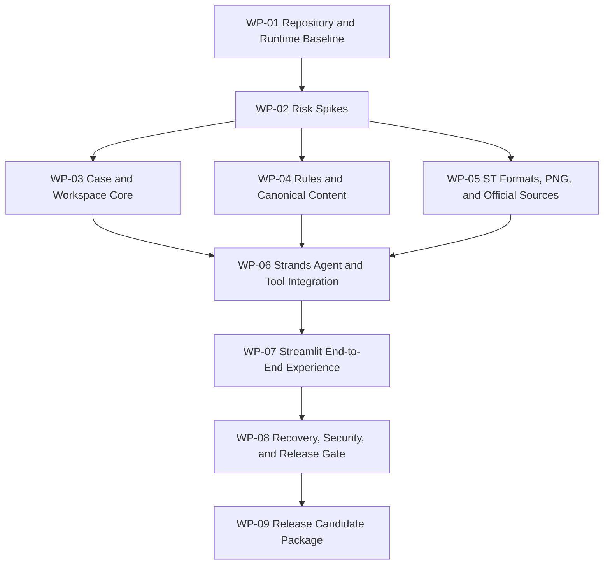

---

> **Amendment — 2026-09-06 (user decision, product owner)**
> Development model provider amendment: the provider is any OpenAI-compatible endpoint (for example `https://api.example.com/v1`), via the Strands OpenAI-compatible provider adapter. The UI sidebar accepts provider, base URL, model ID, and API key per process; CLI and spike paths read the environment. The former `bedrock-credentials-missing` blocker is void; model selection is an authorized implementation decision. Where this document names "Bedrock"/"AWS" for the development model provider, the OpenAI-compatible provider above is the effective configuration. Work packages, gates, scope, and product behavior otherwise unchanged.

# Project Plan

## 1. Goal and Delivery Result

Build a repeatable local application for independent role-play creators, interactive-fiction writers, and narrative designers. It turns an English story idea and optional source files into a valid SillyTavern character card, an optional PNG character card using a user-provided image, and a standalone or embedded lorebook.

The working result must show a real Strands agent collecting necessary intent, choosing and calling bounded tools, writing recoverable work files, building deliverables, checking current format sources, validating files, and closing the case.

This project is being built for **Agents for Humans**.

## 2. Fixed Product Scope

### P0 includes

- a local Python application using the AWS Strands Agents SDK with a an OpenAI-compatible provider (OpenAI-compatible) development model provider;
- one Streamlit page for New Project, Resume Project, chat, uploads, real progress, blockers, and downloads;
- one character card and one logical lorebook per case;
- TXT and Markdown story input; character-card JSON/PNG and lorebook JSON input;
- PNG, JPEG, WebP, and BMP portrait input;
- gradual Q&A with JSON as the non-blocking default card output;
- standalone, embedded, or both lorebook delivery;
- draft and canonical final Markdown before JSON serialization;
- file-based active-case recovery with no cross-case agent memory;
- Character Card V3/ST-compatible JSON, PNG card packaging, deterministic validation, and final official-source checks;
- modification cases that preserve originals and unrelated extensions;
- an English README, setup instructions, architecture diagram, and representative local demo case.

### P0 excludes

- story playback, chat history monitoring, and long-term narrative memory;
- image generation or editing;
- DOC, DOCX, PDF, OCR, audio, video, archives, and arbitrary file support;
- scripts, Regex automation, third-party ST extensions, exact state machines, and group-chat packages;
- accounts, authentication, database, hosted file storage, project library, or product history;
- multi-agent orchestration, general-purpose tools, AgentCore, and a production web deployment;
- per-case SillyTavern import tests, model playtests, or satisfaction follow-up.

AgentCore remains an optional P1 item only after every P0 product gate passes.

The multi-agent exclusion applies to the ST-Agent runtime. The development workflow in Section 4 may use separate lead, implementation, and review tools without changing the product architecture.

### Product and lifecycle rules

| Area | Required behavior |
| --- | --- |
| Case size | At most one target character card and one logical lorebook per case; a scene card may contain multiple NPCs but does not create a group-chat package |
| Text and JSON input | TXT, Markdown, character-card JSON, and lorebook JSON; each text or JSON file is limited to 2 MiB |
| Card and portrait input | Character-card PNG plus PNG, JPEG, WebP, or BMP portraits; each image/card is limited to 20 MiB and 16 megapixels |
| Case input total | At most 10 files and 50 MiB; valid accepted inputs remain saved when another file is rejected |
| Unsupported input | GIF, TIFF, HEIC, SVG, DOC, DOCX, PDF, archives, OCR, audio, and video receive a clear English rejection |
| Q&A | Absorb existing answers first, ask one highest-value topic at a time, and stop when core experience, authorization, and required dependencies are clear |
| Card default | Ask once about JSON, PNG, or both; an unanswered preference defaults to JSON without blocking |
| Missing PNG image | Continue content work, ask only for the required image, and do not claim JSON satisfies a requested PNG |
| Lorebook choice | Deliver none, standalone, embedded, or both according to the current case; both variants come from one canonical entry set |
| Creative authority | The agent decides ordinary content and technical details after intent is clear; it returns to Q&A only for a material intent, authorization, or dependency gap |
| Content source | Save a readable draft and canonical final Markdown before deterministic JSON and PNG construction; serialization cannot silently rewrite story intent |
| Modification | Treat each modification as a new case, preserve the source and unrelated unknown fields, update canonical text first, and write uniquely named outputs |
| Format check | Retrieve current evidence from configured authoritative sources before finalization; changed, unavailable, or inconclusive evidence blocks delivery |
| User-case testing | Validate file structure and packaging; do not import into SillyTavern or run model playtests for each user case |
| Active recovery | Save full input before downstream work; recover from case files rather than browser state, Strands session history, or agent memory |
| Delivery | Only requested, current-lineage, deterministically valid artifacts with passing source evidence can be delivered |
| Close | File availability closes the case without waiting for satisfaction; remove Q&A, brief, build state, and temporary checks while preserving required assets, drafts, canonical final text, exports, and root README |
| Abandon | Stop work and remove temporary intent/state without deleting user originals or completed creative drafts |
| Language | UI, generated work files, deliverables, README, instructions, and demo material use natural American English |
| Security | Imported content is untrusted data; it cannot add tools, paths, URLs, permissions, or completion authority |
| Time | The representative agent workflow targets three minutes in the primary development environment |

## 3. Architecture Baseline

Development follows [TECHNICAL-ARCHITECTURE.md](TECHNICAL-ARCHITECTURE.md):

- a local, single-process Python 3.12 application;
- Windows as the primary implementation and acceptance environment, with portable Python paths and no untested cross-platform promise;
- one Strands agent with a an OpenAI-compatible provider (OpenAI-compatible) model provider and project-owned tools;
- Streamlit as a thin interface;
- a Case Controller that owns lifecycle and delivery gates;
- local workspace files as the only recoverable case authority;
- Pydantic models for state, outcomes, and canonical content;
- deterministic ST serializers, PNG transport, official-source access, and validators;
- no Strands session manager for business memory;
- no unrestricted filesystem, HTTP, shell, MCP, or code-execution tool.

The project lead may choose small supporting libraries and file granularity inside these boundaries. Any change that adds recurring infrastructure, meaningful cost, a new data authority, or different product behavior returns for user approval.

## 4. Execution Ownership

One role owns each decision type. The agents coordinate through explicit handoffs rather than shared authority.

| Role | Agent | Authority and responsibility |
| --- | --- | --- |
| Product owner | User | Owns product intent and approves material scope, cost, or architecture changes |
| Project lead | Codex | Owns the approved baseline, work-package instructions, technical decisions within that baseline, review disposition, and final acceptance |
| Implementer | Cursor on Windows | Performs all code and test changes in its assigned Windows source checkout, records evidence, and raises blockers or change proposals without silently changing product or architecture scope |
| Independent reviewer | Claude Code | Reviews diffs and test evidence in a separate context and checkout with no source-editing authority; reports concrete findings and does not implement fixes or approve its own work |

The control flow is fixed:

```text
User scope decision
    -> Codex work package
    -> Cursor implementation and evidence
    -> Claude Code independent review
    -> Codex disposition
    -> Cursor correction when required
    -> Codex acceptance
```

Codex provides the single decision role and command channel to Cursor. Review findings are advisory until the project lead accepts, rejects, or narrows them against the PRD and architecture. The reviewer must not edit the implementation it reviews.

Only Cursor modifies application code, tests, runtime resources, build configuration, and the runtime README in the product source repository. The project lead may update shared planning baselines and review dispositions but does not implement code. A review finding can block acceptance only when it cites a requirement or demonstrates a reproducible defect; style preferences remain non-blocking.

Each handoff uses the same compact contract:

1. The project lead provides the base revision, work-package scope, frozen references, acceptance checks, and allowed decisions.
2. Cursor returns the resulting revision, changed files, exact checks and results, known deviations, and any decision it could not make within the baseline.
3. Claude Code receives the same base, implementation diff, and evidence, then reports only reproducible findings with severity and file locations.
4. The project lead records the disposition of every blocking finding before acceptance. Cursor fixes accepted findings; rejected findings do not enter implementation scope.

Each work package receives one complete review. After fixes, the reviewer checks only the changed findings and affected behavior unless the correction changes the architecture or exposes a new failure class.

## 5. Dependency Map



WP-03, WP-04, and WP-05 can proceed independently after the relevant Spike evidence is available. Integration starts only when each exposes a tested contract.

## 6. Delivery Sequence

| Stage | Required result |
| --- | --- |
| Baseline | Runtime installs and starts in the Windows development environment |
| Risk closure | Strands, model provider, ST formats, PNG transport, official-source checks, and the selected model have passing Spike evidence |
| Domain core | Case state, safe workspaces, rule assets, canonical content, serializers, and validators pass their contracts |
| Integration | The Strands agent, bounded tools, and Streamlit complete the main workflow |
| Product acceptance | Recovery, modification, security, cleanup, and representative end-to-end scenarios pass |
| Release candidate | A clean installation can run the representative case and produce the documented files |

If delivery is constrained, AgentCore and every P1 idea remain excluded. The complete local P0 workflow takes priority over polish that does not improve the working result.

## 7. Work Packages

### WP-01 Repository and Runtime Baseline

**Objective:** Establish the smallest repeatable implementation foundation in the Windows development environment.

**Work:**

- keep `project/` as the shared development control plane for the approved Plan, collaboration state, role requirements, and current handoff;
- establish the product source repository separately, with an authoritative Git remote and independent local checkouts for implementation and review;
- create Cursor's Windows source checkout on a local Windows disk and connect a local `project` entry to the shared project documents without committing instance-specific paths or role bindings;
- add a concise English README shell with setup, configuration, run, and test entry points;
- lock exact tested dependencies and supported Python version;
- define environment configuration for AWS region, model ID, and standard credential discovery;
- establish test, static-check, and local Streamlit entry points;
- use `pathlib` and OS-independent application paths while treating Windows as the only required acceptance platform;
- keep credentials, local workspaces, generated cases, internal Chinese planning, and private reference material outside runtime source and logs;
- preserve the approved architecture and project plan as the engineering baseline.

**Exit evidence:** The shared control plane, authoritative Git remote, and independent local checkouts are unambiguous. A fresh Windows environment can install the package, import the application, pass a baseline smoke test, and start the Streamlit shell without embedded credentials or private planning data.

**Covers:** PRD NFR-001 through NFR-004.

### WP-02 Required Risk Spikes

**Objective:** Resolve the four implementation assumptions before they can distort the main build.

**Work:**

- **S-01:** prove one provider-backed Strands invocation can use project-owned custom tools, current structured output, lifecycle hooks, bounded model/tool turns, and a real timeout or cancellation path inside Streamlit;
- **S-02:** inspect current SillyTavern behavior and freeze exact new/modified card, standalone/embedded lorebook, and PNG chunk profiles using golden fixtures;
- **S-03:** prove allowlisted official sources can be retrieved, bounded, recorded, compared with the local profile, and reported unavailable without false success;
- **S-04:** measure the candidate the model provider model on the representative English case for creative quality, tool reliability, latency, and estimated demo cost;
- record each result in the architecture's format resources or decision notes, replacing assumptions with exact implementation inputs;
- verify the chosen the model provider model is actually available in the development environment rather than relying on defaults.

**Exit evidence:** Every architecture Spike has its stated passing evidence. A failed candidate produces a bounded replacement or an explicit blocker; it does not expand product scope.

**Covers:** FR-005 through FR-009, NFR-003, R-01, R-04, and R-06.

### WP-03 Case and Workspace Core

**Objective:** Make every active case recoverable from files and safe against duplicate or partial writes.

**Work:**

- implement typed case phase, condition, manifest revision, operation ID, blocker, delivery preference, artifact reference, and lineage models;
- create and resume the approved English workspace structure;
- validate and canonicalize workspace roots and child paths, including symlink containment;
- reject a user workspace located inside the application source directory;
- save complete user input before model or downstream processing;
- enforce file count, size, image-pixel, and total-case limits;
- implement atomic writes, per-case locking, idempotent mutations, and stale-temporary-file recovery;
- generate `status.md` from `case.json` and rebuild the compact agent context from actual files;
- invalidate downstream artifacts when an upstream hash changes;
- implement delivery cleanup, cleanup-only resume, and explicit abandonment without deleting preserved work.

**Exit evidence:** Automated interruption checks at every phase resume from the first invalid or unfinished step, never overwrite user originals, and never restore deleted Q&A after close.

**Covers:** FR-001, FR-002, FR-010, BR-006 through BR-009, NFR-002, and NFR-004.

### WP-04 English Rules and Canonical Content Pipeline

**Objective:** Turn the approved reference knowledge into neutral, reusable runtime rules and human-readable canonical sources.

**Work:**

- write the English `qa-method`, `creation-workflow`, and `st-content-mapping` resources;
- remove private Seraphina preferences, local paths, unverified format claims, and topic-specific defaults;
- record which standards and references informed each runtime rule while copying no private example or private prose into runtime assets;
- define the Q&A stop condition and one-question response contract;
- implement `CaseBrief`, `DeliveryPreferences`, `CharacterContent`, `LorebookContent`, `LorebookEntry`, and `SourceOverlay` models;
- define stable English draft and canonical Markdown templates;
- round-trip typed content through canonical Markdown before serialization;
- keep one canonical lorebook entry set for standalone and embedded delivery;
- ensure modification overlays preserve unknown fields without turning them into authored content;
- create representative rule fixtures for ordinary character, scene-card, keyword lorebook, constant lorebook, hidden information, and unsupported mechanism cases.

**Exit evidence:** The representative fixtures produce complete briefs and canonical documents with no private defaults, no repeated answered question, and no JSON authored as the creative source.

**Covers:** FR-003, FR-004, FR-005, BR-001 through BR-005, and NFR-001.

### WP-05 ST Formats, Images, PNG, and Official Sources

**Objective:** Produce deterministic artifacts that match the frozen SillyTavern profiles.

**Work:**

- implement content-sniffing readers for supported text, JSON, image, and PNG-card inputs;
- implement the Character Card V3/ST-compatible serializer and source-overlay merge;
- implement separate standalone and embedded SillyTavern lorebook serializers from one canonical model;
- write the reviewed English `format-rules` resource that states supported structures, defaults, PNG transport, validation rules, and current source references;
- preserve required defaults, supported activation settings, extension fields, and stable entry identity;
- decode supported portraits, apply orientation, convert color mode, preserve dimensions, and write PNG;
- implement the Spike-selected `PngCardCodec`, including chunk insertion, extraction, CRC handling, Base64 JSON parsing, and semantic read-back comparison;
- implement allowlisted source retrieval with separate format-specification and target-application authority classes, normalized verified fingerprints, and temporary evidence records;
- implement deterministic card, lorebook, requested-output, lineage, and PNG validators;
- ensure every failed build remains outside final export status and gives repairable issues.

**Exit evidence:** Golden fixtures pass new, modify, standalone, embedded, both, JSON-only, PNG-only, JSON-plus-PNG, unknown-field preservation, non-card PNG rejection, and semantic read-back cases.

**Covers:** FR-001, FR-006, FR-007, FR-008, BR-004, BR-009, and R-01 through R-04.

### WP-06 Strands Agent and Bounded Tool Integration

**Objective:** Create the visible autonomous workflow while preserving deterministic completion authority.

**Work:**

- configure the model provider (the model provider) through environment-backed application settings;
- assemble each fresh invocation from the current system prompt, reviewed rule assets, compact case context, and eight bounded tools;
- implement Pydantic tool arguments, common result envelopes, stable failure codes, and application-injected invocation IDs, operation IDs, active-case identity, and revision checks;
- implement `TurnOutcome` with question, delivered, and blocked results;
- use Strands hooks for sanitized model and tool lifecycle events;
- enforce one active question and let the agent continue autonomously until question, blocker, or ready state;
- reject delivery when `finish_case` has not passed requested-file, lineage, current-source-evidence, and deterministic-validation gates;
- apply bounded provider, structured-output, and format-repair attempts;
- ensure imported prompts cannot add tools, paths, URLs, permissions, or completion authority.

**Exit evidence:** A fake-model integration suite proves the complete tool sequence, Q&A wait/resume, invalid outcome repair, format repair, blocked result, delivery gate, and cleanup. A provider smoke case proves the same product contract with real tool events.

**Covers:** FR-003 through FR-010, BR-001 through BR-010, NFR-003, and NFR-005.

### WP-07 Streamlit End-to-End Experience

**Objective:** Give creators one clear path from idea to downloadable files.

**Work:**

- implement New Project and Resume Project entry states;
- collect the local root, message, supported uploads, Resume, Abandon, and New Modification actions;
- render the saved active question and prevent duplicate submission;
- display sanitized real-time agent and tool events through a compact status area;
- render clear supported-input, model-processing (the model provider), waiting, blocked, and retry guidance in American English;
- list deliverables from verified export references and serve their exact bytes for download;
- keep Streamlit session state limited to view convenience and selected case location;
- make the representative flow clear without product-level frontend work.

**Exit evidence:** A user can start, interrupt, resume, answer Q&A, observe real tool calls, obtain the requested artifacts, abandon a separate case, and open a modification case through one page.

**Covers:** FR-001 through FR-003, FR-009, FR-010, NFR-001, and NFR-005.

### WP-08 Recovery, Security, and Release Gate

**Objective:** Prove that the integrated product meets every P0 failure, data, and delivery condition.

**Work:**

- run the PRD interruption matrix across Q&A, draft, final text, build, PNG, official check, validation, delivery, and cleanup;
- test malformed, mismatched, unsupported, oversized, and maliciously named inputs;
- test root escape, symlink escape, duplicate operation, stale manifest, stale export, unavailable source, provider failure, and cleanup failure paths;
- confirm logs, runtime assets, and deliverables contain no credentials, hidden reasoning, private reference paths, temporary Q&A, or internal Chinese placeholders;
- confirm the runtime package does not depend on sibling Concept or private reference files;
- run project-level SillyTavern acceptance for frozen golden fixtures;
- complete the PRD acceptance matrix and record reproducible evidence;
- freeze exact supported versions and dependency lock used for the demo.

**Exit evidence:** Every P0 PRD acceptance row has a passing result or the release is blocked. Ordinary user cases do not run the project-level ST import suite.

**Covers:** All PRD acceptance rows, especially FR-008, FR-010, NFR-002, and NFR-004.

### WP-09 Release Candidate Package

**Objective:** Make the completed application understandable, repeatable, and ready for local demonstration.

**Work:**

- prepare one original English story case that requests PNG plus standalone and embedded lorebooks;
- run the case from a clean workspace and retain its input, expected artifact set, and acceptance evidence;
- finish the English README with purpose, target creator, architecture, setup, credentials, supported inputs, data handling, limitations, run steps, and test steps;
- update the English architecture diagram to match the implemented system;
- confirm a fresh Windows environment can install dependencies and complete the representative workflow;
- record exact supported versions, model configuration, known limitations, and generated file locations;
- make the optional AgentCore go/no-go decision only after the local P0 release gate passes.

**Exit evidence:** A reviewer with no conversation history can install the application, run the representative case, observe real Strands tool work, and inspect every expected artifact.

**Covers:** NFR-001 through NFR-005 and the complete local product path.

## 8. Verification Gates

| Gate | Required evidence | Blocks |
| --- | --- | --- |
| G-01 Runtime | S-01 and S-04 pass with a real the model provider model | Agent integration |
| G-02 Format | S-02 freezes card, lorebook, and PNG profiles | Runtime format generation |
| G-03 Source | S-03 proves pass and unavailable behavior | Delivery finalization |
| G-04 Domain | State, workspace, canonical content, and codecs pass isolated tests | Full integration |
| G-05 Agent | Fake-model and live Strands paths obey tool and delivery contracts | UI acceptance |
| G-06 Product | PRD end-to-end and recovery matrix pass from a clean workspace | Release candidate |
| G-07 Release | Fresh Windows install, README, architecture diagram, representative case, and expected artifact set pass | P0 acceptance |

Tests should prove behavioral contracts and risky transformations. Low-impact display details do not require duplicate tests when the complete UI path already verifies them.

## 9. PRD Traceability

| PRD requirement | Primary work package | Final evidence |
| --- | --- | --- |
| FR-001 Input files | WP-03, WP-05, WP-07 | Supported, rejected, corrupt, and limit fixtures |
| FR-002 Workspace and recovery | WP-03, WP-08 | Interruption and resume matrix |
| FR-003 Q&A and defaults | WP-04, WP-06, WP-07 | JSON-default and PNG-missing-image paths |
| FR-004 Creation method | WP-04, WP-06 | Brief-to-canonical fixture set |
| FR-005 Rule assets | WP-04, WP-08 | Reviewed English rules and representative acceptance |
| FR-006 Card and lorebook | WP-05, WP-06 | Golden new/modify and delivery combinations |
| FR-007 PNG | WP-02, WP-05 | Frozen chunks, conversion, and semantic read-back |
| FR-008 Official check | WP-02, WP-05, WP-08 | Current, changed, unavailable, and inconclusive evidence |
| FR-009 Streamlit | WP-06, WP-07 | Recorded real tool events and complete page flow |
| FR-010 Lifecycle | WP-03, WP-06, WP-08 | Failure, delivery, cleanup, and abandonment matrix |
| NFR-001 English | WP-04, WP-07, WP-09 | Product, README, and generated-language review |
| NFR-002 Reliability | WP-03, WP-08 | Atomicity, idempotency, lineage, and clean-install pass |
| NFR-003 Time and cost | WP-02, WP-09 | Model measurement and three-minute representative run |
| NFR-004 Data and security | WP-01, WP-03, WP-06, WP-08 | Path, prompt-injection, secret, and cleanup checks |
| NFR-005 Visible autonomy | WP-06, WP-07, WP-09 | Real Strands tool sequence in the UI |
| BR-001 Intent gate | WP-04, WP-06 | No final build before material intent and authorization gaps are resolved |
| BR-002 No repeated Q&A | WP-04, WP-06 | Existing-input and correction fixtures do not repeat answered topics |
| BR-003 JSON default | WP-04, WP-06, WP-07 | Skipped output preference produces JSON without extending other authorization |
| BR-004 Lorebook selection | WP-04, WP-05 | None, standalone, embedded, and both combinations match the case |
| BR-005 Agent autonomy | WP-04, WP-06 | Ordinary content and format decisions proceed without approval loops |
| BR-006 Delivery boundary | WP-03, WP-06, WP-07 | Valid files become available and close without satisfaction tracking |
| BR-007 No cross-case memory | WP-03, WP-06 | Fresh agent reconstruction and close cleanup leave no Q&A recovery source |
| BR-008 Imported prompt safety | WP-03, WP-06, WP-08 | Malicious input cannot change tools, permissions, or lifecycle authority |
| BR-009 Project-level runtime tests | WP-05, WP-08 | Golden ST acceptance is frozen in rules and absent from user-case execution |
| BR-010 American English | WP-04, WP-07, WP-09 | Product and release-material review passes |

## 10. Risks and Responses

| Risk | Early signal | Required response |
| --- | --- | --- |
| the model provider model access is unavailable | S-01 cannot invoke the configured model | Switch to the next authorized model in the list or report a bounded blocker; do not expand product scope silently |
| Model is creative but unreliable with tools | S-04 repeats, skips gates, or produces invalid outcomes | Improve contracts and prompt, then select a more reliable the model provider model within the same architecture |
| CCv3 and ST formats disagree | S-02 cannot round-trip a shared schema | Keep explicit serializer profiles and target the verified ST behavior; document the supported baseline |
| PNG compatibility remains ambiguous | `chara`/`ccv3` fixtures disagree across readers | Choose the smallest verified chunk strategy and state its compatibility; block unsupported promises |
| Official pages change or resist extraction | S-03 produces unstable or inconclusive evidence | Use exact source/commit URLs where possible and block finalization when current evidence is insufficient |
| Full run exceeds three minutes | S-04 or rehearsal exceeds the target | Reduce redundant model invocations and context, and reuse deterministic services |
| Rule assets inherit private assumptions | Fixture review shows topic or relationship defaults | Rewrite the rule and add a neutral counterexample before integration |
| Recovery logic consumes schedule | interruption matrix exposes broad rework | Preserve the manifest and atomic-write minimum; remove UI polish before weakening recovery |
| Windows-only implementation introduces path defects | tests assume POSIX paths, separators, permissions, or shell behavior | Use `pathlib`, temporary directories, PowerShell-safe instructions, and run all acceptance evidence on Windows |
| Implementation instructions conflict | Cursor receives scope or priorities outside the current lead work package | Treat the current Codex package as the only implementation instruction; route proposed changes back to the project lead |
| Review independence erodes | the reviewer edits code or reviews from the implementation conversation | Keep Claude Code read-only and give it the frozen requirements, diff, and test evidence in a separate context |
| Scope expands during implementation | work appears outside P0 | Reject it unless it repairs a failed product gate; AgentCore remains P1 |

## 11. Definition of Done

P0 is complete only when:

1. all seven verification gates pass on the exact dependency lock used for acceptance;
2. every PRD requirement has the evidence listed in the traceability table;
3. the representative case completes from a clean workspace within the target time;
4. requested JSON, PNG, standalone, and embedded outputs are valid and downloadable;
5. interruption, resume, blocked, abandonment, delivery, and cleanup behavior match the PRD;
6. a fresh Windows environment can install and run the exact release candidate from the English README;
7. the product source repository is self-contained and contains no credentials, private references, internal planning dependency, temporary user Q&A, or instance-specific role binding;
8. the representative case and expected artifact set demonstrate the complete working path;
9. Claude Code reports no unresolved blocking finding, and Codex records the final acceptance decision.

P1 cannot delay or redefine this completion condition.

## 12. Approval and Handoff

- C-025 approved the complete PRD on September 5, 2026.
- C-026 approved the core technical boundary between Strands reasoning and deterministic completion control on September 5, 2026.
- C-029 jointly approved the complete technical architecture, this project plan, and the stated execution ownership on September 5, 2026.
- Plan conclusion: approved for development. Approval date: September 5, 2026. Jointly approved architecture: version 1.
- `project/Plan/` is the development baseline. After the required project initialization, Codex issues bounded work packages to Cursor in dependency order and keeps accepted decisions synchronized with these two files.
- Cursor performs implementation and tests on Windows. Claude Code reviews each completed package independently. Codex resolves findings and accepts or returns the package.
- Live model Spikes require working credentials and model access in the development environment; the development key stays in the local environment (or a local untracked env file) and no credential value enters the product repository, source, evidence, or review prompts.
- Product-scope changes, recurring infrastructure, a new state authority, or material cost require user approval and an updated baseline. Ordinary implementation findings are resolved by Codex and recorded in the relevant engineering artifact.
